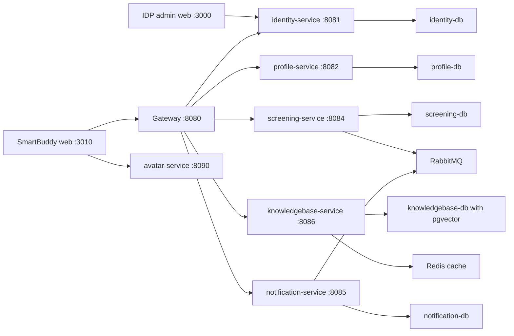

# SmartBuddy

SmartBuddy is a Docker-first microservices application for child speech screening, branch enrolment, therapist assessment, teacher practice support, parent home practice, knowledgebase guidance, notifications, and avatar-based practice.

## Applications and URLs

| Component | Local URL | Purpose |
|---|---:|---|
| SmartBuddy web | `http://localhost:3010` | Parent, Branch Admin, Teacher, and Therapist application |
| IDP admin web | `http://localhost:3000` | Identity, organization, branch, role, group, and user administration |
| API gateway | `http://localhost:8080` | Single entry point for Java microservice APIs |
| Identity Service | `http://localhost:8081` | Direct identity API, also routed through gateway |
| Profile Service | `http://localhost:8082` | Direct profile API, also routed through gateway |
| Screening Service | `http://localhost:8084` | Direct screening API, also routed through gateway |
| Knowledgebase Service | `http://localhost:8086` | Direct KB API, also routed through gateway |
| Avatar Service | `http://localhost:8090` | Avatar, voice, audio, and practice session API |
| RabbitMQ console | `http://localhost:15672` | Event broker management, default `guest` / `guest` |

The single Postman collection is [postman/SpeechBuddy-Backend.postman_collection.json](/C:/Users/Abcom/java_projects/smartbuddy/postman/SpeechBuddy-Backend.postman_collection.json). It replaces the older split collections and contains folders named by microservice: `gateway`, `identity-service`, `profile-service`, `screening-service`, `knowledgebase-service`, `notification-service`, and `avatar-service`.

## Architecture

SmartBuddy uses independently deployable services with separate data ownership.



| Service | Responsibility | Database or state |
|---|---|---|
| `gateway` | Routes browser and Postman traffic to Java services and exposes health/info | Stateless |
| `identity-service` | Login, signup, JWT sessions, organizations, branches, roles, groups, permissions, access checks | `identity-db` |
| `profile-service` | User profiles, child entities, relationships, consent, privacy, branch dashboards, staff assignments | `profile-db` |
| `screening-service` | Questionnaires, parent screening, therapist assessment, plans, comments, progress, reviews | `screening-db` |
| `knowledgebase-service` | Public KB, admin content workflow, exercises, avatar scripts, internal recommendations | `knowledgebase-db`, Redis |
| `notification-service` | Reads emitted notifications/events for operational visibility | `notification-db`, RabbitMQ |
| `avatar-service` | Voice list, text-to-speech, audio files, avatars, reference images, avatar sessions, websocket voice flow | Docker volumes for audio/cache |

## Install Notes

Prerequisites:

- Docker Desktop with Compose.
- Java and Node are only needed for local development outside Docker.
- Optional API keys: `GROQ_API_KEY` for LLM-backed plan/content features.

Start the full application:

```powershell
docker compose up --build -d
```

If a local checkout does not include `services/practice-service`, remove or comment the `practice-service` block and its gateway dependency before starting the full compose stack. The current SmartBuddy flows use identity, profile, screening, knowledgebase, notification, avatar, and web services.

Useful validation commands:

```powershell
docker compose ps
Invoke-WebRequest http://localhost:8080/actuator/health
Invoke-WebRequest http://localhost:3010
```

Rebuild only one changed service to save build time:

```powershell
docker compose build identity-service
docker compose up -d identity-service
```

Import the Postman collection from `postman/SpeechBuddy-Backend.postman_collection.json`, run any `Login - ...` request in `identity-service`, and the collection saves `accessToken` and `refreshToken` variables for protected APIs.

## Validation Users

Use these realistic SmartBuddy identities for local Docker validation and Postman/UI walkthroughs. Emails follow the `firstname@smartbuddy.com` convention, and every documented ID maps to the same person wherever it appears.

| Role | Name | User ID | Email | Password | What this role can do |
|---|---|---|---|---|---|
| Platform Admin | Ashok Sharma | `8b2ff56f-0d80-4a96-b304-9d38d9bde425` | `ashok@smartbuddy.com` | `ChangeMe123!` | Bootstrap/admin login, organization setup, role and permission administration, pending-user approval |
| Branch Admin | Suresh Kumar | `2a9d20d0-09c8-4af4-af2a-4c7b44229a91` | `suresh@smartbuddy.com` | `BranchTest123!` | Branch dashboard, family enrolment, teacher/therapist assignment, branch plan visibility settings |
| Parent | Priya Mehta | `dca3dda0-3318-4161-b7ea-10c02df4b8f9` | `priya@smartbuddy.com` | `ParentReset123!` | Child profile access, consent, parent screening, active plan viewing, home practice progress |
| Parent | Pooja Sharma | `c9b12d60-3ccb-4b87-a663-6805ed5f4ae1` | `pooja@smartbuddy.com` | `Parent@135504` | Alternate parent validation and family workflow checks |
| Child | Rahul Verma | `5491492b-ef5b-4f9c-a847-40642eee6891` | No login | N/A | Child profile, enrolment target, screening target, therapist assessment target, plan/progress target |
| Teacher | Kanika Verma | `13628ae5-477b-45df-b8c4-e571da1994d2` | `kanika@smartbuddy.com` | `TeacherTest123!` | Assigned children, class practice tasks, progress updates, teacher plan notes |
| Therapist | Neha Singh | `e994e954-58fd-46f7-ad32-937349b88970` | `neha@smartbuddy.com` | `TherapistTest123!` | Assigned children, therapist assessment, plan generation, comments, review, approval |

## Business Flows

1. Platform setup: Ashok Sharma logs into IDP admin, creates or verifies organization, branch, roles, access permissions, and branch admin membership.
2. Branch onboarding: Suresh Kumar creates or links a family, enrols Rahul Verma as a child, and assigns Kanika Verma and Neha Singh.
3. Parent screening: Priya Mehta logs into SmartBuddy web, reviews Rahul Verma's profile/consent, completes screening questions, and views the latest result.
4. Therapist assessment: Neha Singh reviews assigned children, completes therapist assessment for Rahul Verma, generates a plan, adds comments, and approves the plan.
5. Teacher practice: Kanika Verma opens assigned children, views the active plan, completes teacher-visible tasks, and records progress notes.
6. Parent home practice: Priya Mehta views the approved active plan, completes parent-visible activities, and records home practice progress.
7. Knowledgebase support: public pages and internal APIs provide categories, documents, FAQs, exercises, safety disclaimers, and avatar scripts.
8. Avatar practice: the web app calls Avatar Service for voices, speech audio, sessions, and websocket voice conversation.
9. Notifications: services publish events through RabbitMQ and Notification Service exposes received notification records.

## User Flows by Role

| Role | Main user flow |
|---|---|
| Platform Admin | Login, manage organizations, branches, roles, groups, permission catalog, policies, and user lifecycle |
| Branch Admin | Login, view branch dashboard, create/enrol families, manage child details, assign teachers/therapists, control plan visibility |
| Parent | Login, manage own profile, review child profile, grant consent, submit screening, view plan, complete home activities |
| Child | No direct login; represented as a profile entity used by screening, assessment, plan, practice, and progress workflows |
| Teacher | Login, view assigned children, open active plans, complete school tasks, add progress and plan feedback |
| Therapist | Login, view assigned children, run assessment, generate/update/approve plans, add comments, review progress |

## API Details

All Java service APIs are available through the gateway unless marked as direct only. Use `Authorization: Bearer {{accessToken}}` for protected APIs.

### gateway

- `GET /actuator/health` - gateway health.
- `GET /actuator/info` - gateway info.
- Routes `/api/v1/auth/**`, `/api/v1/admin/**`, `/api/v1/organizations/**`, `/api/v1/authorization/**`, `/api/v1/users/**`, `/api/v1/entities/**`, `/api/v1/branches/**`, `/api/v1/teachers/**`, `/api/v1/therapists/**`, `/api/v1/screening/**`, `/api/v1/notifications/**`, `/api/v1/kb/**`, `/admin/api/v1/kb/**`, and `/internal/api/v1/kb/**`.

### identity-service

Authentication:

- `POST /api/v1/auth/signup` - start parent signup.
- `POST /api/v1/auth/admin/bootstrap-signup` - bootstrap first platform admin.
- `POST /api/v1/auth/signup/verify-otp` - verify signup OTP.
- `POST /api/v1/auth/login` - authenticate and issue tokens.
- `POST /api/v1/auth/refresh` - refresh access token.
- `POST /api/v1/auth/logout` - end refresh-token session.
- `POST /api/v1/auth/password-reset/request` - send reset OTP.
- `POST /api/v1/auth/password-reset/confirm` - set new password using OTP.
- `GET /api/v1/auth/me` - current identity profile.
- `PUT /api/v1/auth/me/profile` - update current identity profile.
- `PATCH /api/v1/auth/me/status` - update current user status.

Organizations and branches:

- `POST /api/v1/organizations`, `GET /api/v1/organizations`, `GET /api/v1/organizations/{id}`, `PATCH /api/v1/organizations/{id}/status`, `DELETE /api/v1/organizations/{id}`.
- `POST /api/v1/organizations/{organizationId}/branches`, `GET /api/v1/organizations/{organizationId}/branches`, `GET /api/v1/organizations/{organizationId}/branches/{branchId}`, `PUT /api/v1/organizations/{organizationId}/branches/{branchId}`, `PATCH /api/v1/organizations/{organizationId}/branches/{branchId}/status`, `DELETE /api/v1/organizations/{organizationId}/branches/{branchId}`.
- `GET /api/v1/organizations/{organizationId}/branches/{branchId}/roles`, `POST /api/v1/organizations/{organizationId}/branches/{branchId}/members`, `GET /api/v1/organizations/{organizationId}/branches/{branchId}/members`, `PATCH /api/v1/organizations/{organizationId}/branches/{branchId}/members/{userId}/status`.

Admin user, roles, groups, and access control:

- `POST /api/v1/admin/users`, `POST /api/v1/admin/users/parent-setup/resend`, `GET /api/v1/admin/users/{userId}`, `GET /api/v1/admin/users/{userId}/groups`, `GET /api/v1/admin/users/organization/{organizationId}`, `POST /api/v1/admin/users/{userId}/roles`, `GET /api/v1/admin/users/{userId}/role-assignments`, `PATCH /api/v1/admin/users/{userId}/status`, `POST /api/v1/admin/users/{userId}/approve-creation`, `PUT /api/v1/admin/users/{userId}/profile`, `DELETE /api/v1/admin/users/{userId}/roles/{role}`, `DELETE /api/v1/admin/users/{userId}/role-assignments/{assignmentId}`.
- `GET /api/v1/admin/roles`, `GET /api/v1/admin/roles/{code}`, `POST /api/v1/admin/roles`, `PUT /api/v1/admin/roles/{code}`, `PATCH /api/v1/admin/roles/{code}/status`, `DELETE /api/v1/admin/roles/{code}`.
- `POST /api/v1/admin/groups`, `GET /api/v1/admin/groups`, `GET /api/v1/admin/groups/{groupId}`, `PUT /api/v1/admin/groups/{groupId}`, `PATCH /api/v1/admin/groups/{groupId}/status`, `DELETE /api/v1/admin/groups/{groupId}`, `POST /api/v1/admin/groups/{groupId}/users`, `POST /api/v1/admin/groups/{groupId}/users/bulk`, `GET /api/v1/admin/groups/{groupId}/users`, `DELETE /api/v1/admin/groups/{groupId}/users/{userId}`.
- `GET/POST /api/v1/admin/access-control/objects`, `PUT/PATCH/DELETE /api/v1/admin/access-control/objects/{id}`, `GET/POST /api/v1/admin/access-control/types`, `PUT/PATCH/DELETE /api/v1/admin/access-control/types/{id}`, `GET/POST /api/v1/admin/access-control/permissions`, `PUT/PATCH/DELETE /api/v1/admin/access-control/permissions/{id}`.
- `GET/POST /api/v1/admin/access-control/organizations/{organizationId}/roles/{roleId}/permissions`, `DELETE /api/v1/admin/access-control/organizations/{organizationId}/roles/{roleId}/permissions/{permissionId}`.
- `POST /api/v1/authorization/check`.
- `GET/POST /api/v1/admin/role-assignment-policies`, `PUT/DELETE /api/v1/admin/role-assignment-policies/{id}`.

### profile-service

- `GET /api/v1/users/me/profile`, `PUT /api/v1/users/me/profile`.
- `POST /api/v1/entities`, `GET /api/v1/entities`, `GET /api/v1/entities/{entityId}`, `PUT /api/v1/entities/{entityId}`, `DELETE /api/v1/entities/{entityId}`.
- `POST /api/v1/entities/{entityId}/relationships`, `GET /api/v1/entities/{entityId}/relationships`.
- `POST /api/v1/entities/{entityId}/tags`, `GET /api/v1/entities/{entityId}/tags`, `DELETE /api/v1/entities/{entityId}/tags/{tagId}`.
- `POST /api/v1/entities/{entityId}/consents`, `GET /api/v1/entities/{entityId}/consents`, `POST /api/v1/entities/{entityId}/consents/withdraw`.
- `POST /api/v1/entities/{entityId}/organization-links`, `GET /api/v1/entities/{entityId}/organization-links`, `DELETE /api/v1/entities/{entityId}/organization-links/{linkId}`.
- `POST /api/v1/entities/{entityId}/privacy/delete-request`, `POST /api/v1/entities/{entityId}/privacy/export-request`, `GET /api/v1/entities/{entityId}/privacy/status`.
- `GET /api/v1/internal/entities/{entityId}/context`, `GET /api/v1/internal/entities/{entityId}/access-check`, `GET /api/v1/internal/entities/{entityId}/consent-check`.
- `GET /api/v1/branches/{branchId}/dashboard`, `GET /api/v1/branches/{branchId}/children`, `GET /api/v1/branches/{branchId}/children/{childId}`, `PUT /api/v1/branches/{branchId}/children/{childId}/family`, `POST /api/v1/branches/{branchId}/children/{childId}/family/deactivate`, `POST /api/v1/branches/{branchId}/families`, `POST /api/v1/branches/{branchId}/children/{childId}/enroll`.
- `GET /api/v1/branches/{branchId}/teachers`, `GET /api/v1/branches/{branchId}/therapists`, `GET /api/v1/branches/{branchId}/plan-settings`, `PUT /api/v1/branches/{branchId}/plan-settings`.
- `POST /api/v1/branches/{branchId}/children/{childId}/assignments`, `GET /api/v1/branches/{branchId}/children/{childId}/assignments`, `PATCH /api/v1/branches/{branchId}/children/{childId}/assignments/{assignmentId}`.
- `GET /api/v1/teachers/me/dashboard`, `GET /api/v1/teachers/me/children`, `GET /api/v1/teachers/me/children/{childId}`, `GET /api/v1/teachers/me/children/{childId}/plans/active`, `GET /api/v1/teachers/me/children/{childId}/progress`.
- `GET /api/v1/therapists/me/dashboard`, `GET /api/v1/therapists/me/children`, `GET /api/v1/therapists/me/children/{childId}`.
- `GET /api/v1/internal/entities/{childId}/teacher-access-check`, `GET /api/v1/internal/entities/{childId}/therapist-access-check`, `GET /api/v1/internal/entities/{childId}/plan-settings`.

### screening-service

- `POST /api/v1/screening/questionnaires`, `GET /api/v1/screening/questionnaires/{id}`, `POST /api/v1/screening/questionnaires/{id}/questions`, `GET /api/v1/screening/questionnaires/{id}/questions`, `GET /api/v1/screening/questionnaires/{id}/questions/{questionId}`, `POST /api/v1/screening/questionnaires/{id}/publish`.
- `GET /api/v1/entities/{entityId}/screening/questionnaire`, `POST /api/v1/entities/{entityId}/screening/attempts`, `POST /api/v1/entities/{entityId}/screening/attempts/{attemptId}/responses`, `POST /api/v1/entities/{entityId}/screening/attempts/{attemptId}/submit`, `GET /api/v1/entities/{entityId}/screening/latest`, `GET /api/v1/entities/{entityId}/screening/history`, `POST /api/v1/entities/{entityId}/screening/reports`.
- `GET /api/v1/entities/{entityId}/support-plan`.
- `GET /api/v1/entities/{entityId}/therapist-assessment/questionnaire`, `POST /api/v1/entities/{entityId}/therapist-assessment/attempts`, `POST /api/v1/entities/{entityId}/therapist-assessment/attempts/{attemptId}/responses`, `POST /api/v1/entities/{entityId}/therapist-assessment/attempts/{attemptId}/submit`, `GET /api/v1/entities/{entityId}/therapist-assessment/history`, `GET /api/v1/entities/{entityId}/therapist-assessment/latest`.
- `POST /api/v1/entities/{entityId}/plans/generate`, `GET /api/v1/entities/{entityId}/plans/latest`, `GET /api/v1/entities/{entityId}/plans/active`, `PUT /api/v1/entities/{entityId}/plans/{planId}`, `POST /api/v1/entities/{entityId}/plans/{planId}/approve`, `GET /api/v1/entities/{entityId}/plans/{planId}/comments`, `POST /api/v1/entities/{entityId}/plans/{planId}/comments`, `GET /api/v1/entities/{entityId}/plans`, `POST /api/v1/entities/{entityId}/plans/{planId}/activities/{activityId}/progress`.
- `POST /api/v1/screening/skill-checks/{attemptId}/complete`, `GET /api/v1/screening/children/{childId}/active-plan`, `POST /api/v1/screening/plans/{planId}/items/{planItemId}/feedback`, `GET /api/v1/screening/plans/{planId}/items/{planItemId}/feedback`, `GET /api/v1/screening/plans/{planId}/progress`, `POST /api/v1/screening/plans/{planId}/review`.
- `POST /api/v1/internal/entities/{entityId}/deactivate`.

### knowledgebase-service

- Public: `GET /api/v1/kb/categories`, `GET /api/v1/kb/categories/{code}`, `GET /api/v1/kb/categories/{code}/documents`, `GET /api/v1/kb/documents/{slug}`, `GET /api/v1/kb/faqs`, `GET /api/v1/kb/search`, `POST /api/v1/kb/query`, `POST /api/v1/kb/bulk`.
- Admin: `POST /admin/api/v1/kb/categories`, `PUT /admin/api/v1/kb/categories/{code}`, `POST /admin/api/v1/kb/documents`, `PUT /admin/api/v1/kb/documents/{slug}`, `POST /admin/api/v1/kb/documents/{slug}/submit-review`, `POST /admin/api/v1/kb/documents/{slug}/approve`, `POST /admin/api/v1/kb/documents/{slug}/publish`, `POST /admin/api/v1/kb/documents/{slug}/archive`, `POST /admin/api/v1/kb/documents/{slug}/reindex`, `POST /admin/api/v1/kb/documents/extract-text`, `POST /admin/api/v1/kb/exercises`, `POST /admin/api/v1/kb/exercises/{code}/status/{status}`, `POST /admin/api/v1/kb/avatar-scripts`, `POST /admin/api/v1/kb/avatar-scripts/{code}/status/{status}`, `POST /admin/api/v1/kb/media`.
- Internal: `GET /internal/api/v1/kb/recommendations`, `GET /internal/api/v1/kb/templates/safety-disclaimers`, `GET /internal/api/v1/kb/exercises`, `GET /internal/api/v1/kb/avatar-scripts`, `POST /internal/api/v1/kb/bulk`. Internal APIs require `X-Internal-Api-Key`.

### notification-service

- `GET /api/v1/notifications` - list notification records ordered by receive time.

### avatar-service

- `GET /health`, `GET /api/avatar-system/health`, `GET /api/avatar-system/voices`.
- `POST /api/v1/avatar/speak`, `GET /api/v1/avatar/audio/{request_id}`.
- `POST /api/avatars`, `GET /api/avatars`, `GET /api/avatars/{avatar_id}`, `PUT /api/avatars/{avatar_id}`.
- `POST /api/avatar-reference-images`, `GET /api/avatar-reference-images`, `POST /api/avatars/{avatar_id}/reference-images`.
- `POST /api/avatar-sessions`, `GET /api/avatar-sessions/history`, `GET /api/avatar-sessions/{session_id}`.
- `WEBSOCKET /ws/voice-conversation`.

## Deployment Approach

SmartBuddy should be deployed the same way this local Docker setup is organized: every microservice has its own image, its own runtime port, and its own database or state dependency. The root `docker-compose.yml` clubs those independent pieces together for local/integration deployment, while production can promote each image independently.

For a fresh checkout, the one-file deployment entry point is `docker-compose.yml`. Do not run one individual Dockerfile to install the whole application. The compose file is the installer/orchestrator: it builds each service from its own Dockerfile, starts the required databases and infrastructure, connects everything on the `speechbuddy` Docker network, and brings the services up in the correct dependency order.

Use this command for full local deployment:

```powershell
docker compose up --build -d
```

That single command uses these Dockerfiles internally:

- `services/gateway/Dockerfile`
- `services/identity-service/Dockerfile`
- `services/profile-service/Dockerfile`
- `services/screening-service/Dockerfile`
- `services/knowledgebase-service/Dockerfile`
- `services/notification-service/Dockerfile`
- `avatar-service/Dockerfile`
- `smartbuddy-web/Dockerfile`
- `axnovus-idp-admin/Dockerfile`

The practical deployment split is:

1. Backend platform deployment: gateway, identity, profile, screening, knowledgebase, notification, avatar, PostgreSQL databases, Redis, RabbitMQ, and Docker volumes.
2. SmartBuddy web deployment: `smartbuddy-web` as a separate frontend image that points to the gateway and avatar URLs.
3. IDP admin deployment: `axnovus-idp-admin` as a separate admin frontend image that points to Identity Service.

This gives independent service releases while still allowing one local compose command for integration testing.

### Prerequisites

- Docker Desktop or Docker Engine with Compose v2.
- Network access during image build for base images and dependency download.
- Java services use Maven inside Docker, so local Maven/JDK installation is not required for Docker builds.
- Frontend services use Node inside Docker, so local Node installation is not required for Docker builds.
- Avatar Service downloads Python packages and voice assets during build; keep the Docker cache/volumes to avoid repeated slow downloads.
- Environment secrets should be supplied through `.env`, CI/CD secrets, or orchestrator secrets. Do not hardcode production secrets in compose.

Important local environment variables:

| Variable | Used by | Default in compose | Notes |
|---|---|---|---|
| `JWT_SECRET` | Identity, Profile, Screening, Knowledgebase | `change-this-development-secret-before-production` | Must be same across JWT-producing/validating Java services |
| `AUTH_HASH_SECRET` | Identity | development default | Used by identity security hashing |
| `IDENTITY_BOOTSTRAP_ADMIN_EMAIL` | Identity | `ashok@smartbuddy.com` | Bootstrap admin email |
| `IDENTITY_BOOTSTRAP_ADMIN_PASSWORD` | Identity | `ChangeMe123!` | Bootstrap admin password |
| `KB_INTERNAL_API_KEY` | Knowledgebase | `change-this-knowledgebase-internal-key` | Required for internal KB APIs |
| `GROQ_API_KEY` | Screening, Knowledgebase, Avatar | empty | Optional LLM features |
| `VITE_GATEWAY_API_BASE_URL` | SmartBuddy web | `http://localhost:8080/api/v1` | Frontend build-time API base |
| `VITE_AVATAR_API_BASE_URL` | SmartBuddy web | `http://localhost:8091` | For this compose file, set to `http://localhost:8090` unless port mapping changes |
| `VITE_IDENTITY_API_BASE_URL` | IDP admin web | `http://localhost:8081/api/v1` | IDP admin identity endpoint |

### Service, Database, and Dockerfile Matrix

| Deployment unit | Dockerfile/build context | Runtime port | Database/state | Depends on | Deploy with |
|---|---|---:|---|---|---|
| `gateway` | `services/gateway/Dockerfile` | `8080` | Stateless | Identity, Profile, Screening, Notification, Knowledgebase | `docker compose build gateway && docker compose up -d gateway` |
| `identity-service` | `services/identity-service/Dockerfile` | `8081` | `identity-db` PostgreSQL | `identity-db` | `docker compose build identity-service && docker compose up -d identity-service` |
| `profile-service` | `services/profile-service/Dockerfile` | `8082` | `profile-db` PostgreSQL | `profile-db`, Identity JWT secret | `docker compose build profile-service && docker compose up -d profile-service` |
| `screening-service` | `services/screening-service/Dockerfile` | `8084` | `screening-db` PostgreSQL | `screening-db`, Profile Service, RabbitMQ, Identity JWT secret | `docker compose build screening-service && docker compose up -d screening-service` |
| `knowledgebase-service` | `services/knowledgebase-service/Dockerfile` | `8086` | `knowledgebase-db` pgvector, Redis | `knowledgebase-db`, Redis, Identity JWT secret | `docker compose build knowledgebase-service && docker compose up -d knowledgebase-service` |
| `notification-service` | `services/notification-service/Dockerfile` | `8085` internal, routed through gateway | `notification-db` PostgreSQL | `notification-db`, RabbitMQ | `docker compose build notification-service && docker compose up -d notification-service` |
| `avatar-service` | `avatar-service/Dockerfile` | `8090` | `avatar-audio`, `avatar-hf-cache` volumes | Python packages, TTS assets, optional Groq key | `docker compose build avatar-service && docker compose up -d avatar-service` |
| `smartbuddy-web` | `smartbuddy-web/Dockerfile` | `3010` host to Nginx `80` | Static Nginx assets | Gateway, Avatar Service | `docker compose build smartbuddy-web && docker compose up -d smartbuddy-web` |
| `axnovus-idp-admin` | `axnovus-idp-admin/Dockerfile` | `3000` host to Nginx `80` | Static Nginx assets | Identity Service | `docker compose build axnovus-idp-admin && docker compose up -d axnovus-idp-admin` |

Infrastructure services:

| Infrastructure | Image | Purpose | Notes |
|---|---|---|---|
| `identity-db` | `postgres:17-alpine` | Identity database | Volume `identity-data` |
| `profile-db` | `postgres:17-alpine` | Profile database | Volume `profile-data` |
| `screening-db` | `postgres:17-alpine` | Screening database | Host port `8056`, volume `screening-data` |
| `notification-db` | `postgres:17-alpine` | Notification database | Volume `notification-data` |
| `knowledgebase-db` | `pgvector/pgvector:pg17` | Knowledgebase database with vector support | Host port `8057`, volume `knowledgebase-data` |
| `redis` | `redis:7-alpine` | Knowledgebase cache | Internal only |
| `rabbitmq` | `rabbitmq:4-management-alpine` | Event broker | Management UI on `15672` |

### How to Club Services for Deployment

Use three groups for clarity.

Core infrastructure group:

```powershell
docker compose up -d identity-db profile-db screening-db notification-db knowledgebase-db redis rabbitmq
```

Backend microservices group:

```powershell
docker compose build identity-service profile-service screening-service knowledgebase-service notification-service avatar-service gateway
docker compose up -d identity-service profile-service screening-service knowledgebase-service notification-service avatar-service gateway
```

Frontend group:

```powershell
docker compose build smartbuddy-web axnovus-idp-admin
docker compose up -d smartbuddy-web axnovus-idp-admin
```

For a single changed service, rebuild and replace only that service:

```powershell
docker compose build profile-service
docker compose up -d profile-service
```

For frontend-only changes:

```powershell
docker compose build smartbuddy-web
docker compose up -d smartbuddy-web
```

For identity admin UI-only changes:

```powershell
docker compose build axnovus-idp-admin
docker compose up -d axnovus-idp-admin
```

For One time deployment:
```docker compose up --build -d
docker-compose.yml```

### Recommended Startup Order

1. Start databases and infrastructure: PostgreSQL services, Redis, RabbitMQ.
2. Start `identity-service` first because other services validate JWTs created by Identity Service.
3. Start `profile-service` because Screening depends on child/entity context from Profile Service.
4. Start `screening-service`, `knowledgebase-service`, and `notification-service`.
5. Start `avatar-service`.
6. Start `gateway`.
7. Start `smartbuddy-web` and `axnovus-idp-admin`.

The compose file encodes most of this with `depends_on`, but startup order still matters when replacing services manually.

### Current Local Compose Note

The current `docker-compose.yml` references `services/practice-service`, but this checkout does not contain that directory. If using this checkout as-is, remove or comment:

- `practice-service` under `services`.
- The `gateway.depends_on.practice-service` entry.
- The gateway route for `/api/v1/practice-sessions/**` if the missing service will not be restored.

After that, the currently present SmartBuddy services can be deployed together.

### Build Commands by Dockerfile

Direct Docker build commands are useful for CI/CD pipelines that push images to a registry:

```powershell
docker build -t smartbuddy/gateway:local services/gateway
docker build -t smartbuddy/identity-service:local services/identity-service
docker build -t smartbuddy/profile-service:local services/profile-service
docker build -t smartbuddy/screening-service:local services/screening-service
docker build -t smartbuddy/knowledgebase-service:local services/knowledgebase-service
docker build -t smartbuddy/notification-service:local services/notification-service
docker build -t smartbuddy/avatar-service:local avatar-service
docker build -t smartbuddy/smartbuddy-web:local smartbuddy-web
docker build -t smartbuddy/axnovus-idp-admin:local axnovus-idp-admin
```

For SmartBuddy web, pass the correct API URLs at build time:

```powershell
docker build `
  --build-arg VITE_GATEWAY_API_BASE_URL=http://localhost:8080/api/v1 `
  --build-arg VITE_AVATAR_API_BASE_URL=http://localhost:8090 `
  -t smartbuddy/smartbuddy-web:local smartbuddy-web
```

For IDP admin:

```powershell
docker build `
  --build-arg VITE_IDENTITY_API_BASE_URL=http://localhost:8081/api/v1 `
  -t smartbuddy/axnovus-idp-admin:local axnovus-idp-admin
```

### Post-Deployment Validation

Run these checks after deployment:

```powershell
docker compose ps
Invoke-WebRequest http://localhost:8080/actuator/health
Invoke-WebRequest http://localhost:8081/actuator/health
Invoke-WebRequest http://localhost:8082/actuator/health
Invoke-WebRequest http://localhost:8084/actuator/health
Invoke-WebRequest http://localhost:8086/actuator/health
Invoke-WebRequest http://localhost:8090/health
Invoke-WebRequest http://localhost:3010
Invoke-WebRequest http://localhost:3000
```

Then import the Postman collection and validate role flows in this order:

1. Login as Ashok Sharma and verify identity/admin APIs.
2. Login as Suresh Kumar and verify branch dashboard, family enrolment, child assignment, and plan settings.
3. Login as Priya Mehta and verify child profile, screening, active plan, and progress.
4. Login as Kanika Verma and verify teacher dashboard, assigned children, active plan, and teacher progress.
5. Login as Neha Singh and verify therapist dashboard, assessment, plan generation, comments, and approval.

### Production Promotion Model

For production, keep the same boundaries but replace local compose databases with managed infrastructure:

- One image per microservice.
- One managed database/schema per owning service.
- Gateway deployed as the single public backend entry point.
- SmartBuddy web deployed independently from backend services.
- IDP admin deployed independently and restricted to admin users/networks.
- RabbitMQ and Redis deployed as managed or separately operated infrastructure.
- Secrets provided by the deployment platform, not by committed files.
